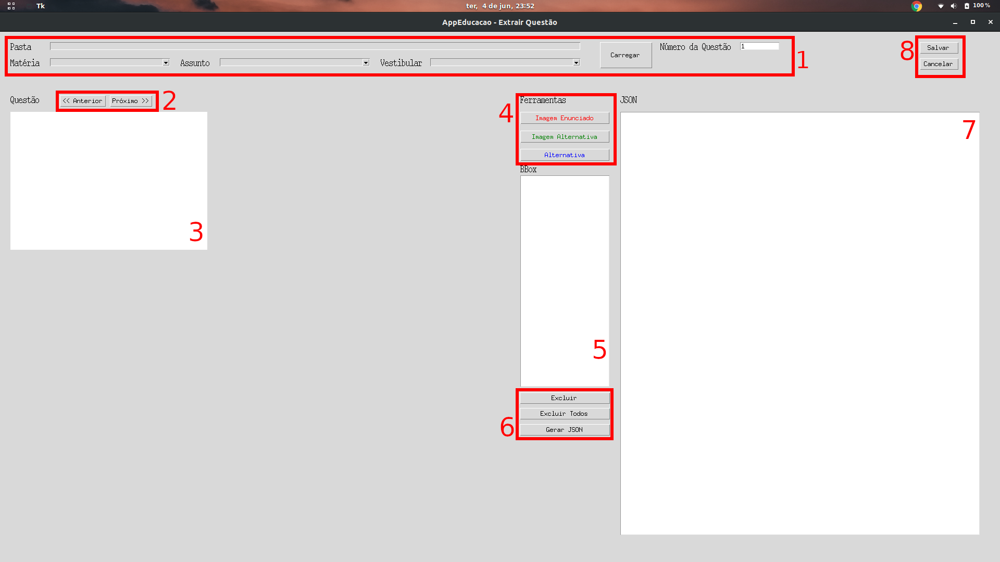
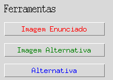
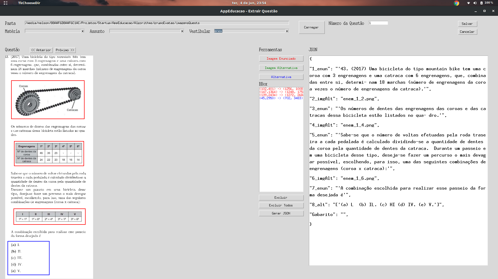
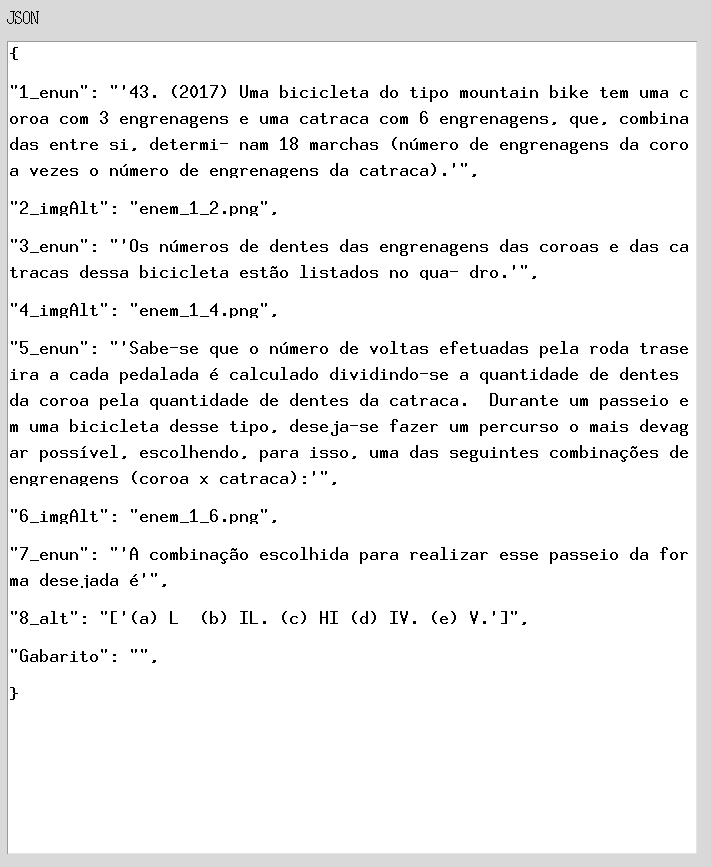
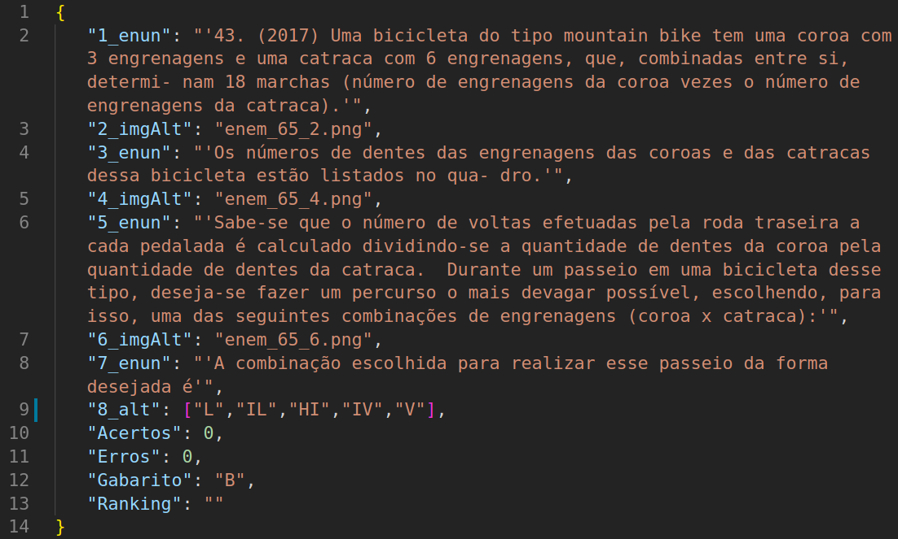
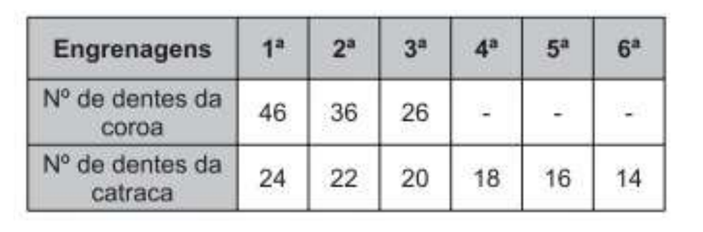
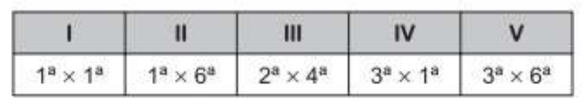

# Configuração do Ambiente

## Pacotes do Python necessários
A versão do python em que o programa foi desenvolvido foi a python 3.7.3 com pip 19.0.3
Programas necessário e seus comandos para a instalação:
- numpy
```bash
pip install numpy
```
- pytesseract
```bash
pip install pytesseract
```
- pillow
```bash
pip install pillow
```
- OpenCV
```bash
pip install opencv-contrib-python
```

## Programas necessários
#### Instalando Tesseract no Windows
- Download [Tesseract Windows Installer](https://github.com/UB-Mannheim/tesseract/wiki), baixar versão 4.0.0.
- Executar instalador(Lembrar o diretório de instalação pois irá precisar).
- Durante a instalação selecionar as linguas portuguese e equation.
- Adicionar tesseract diretório ao PATH.
    - Procurar por variáveis de ambiente no Windows
    - Propriedades do Sistema -> Variáveis de Ambiente -> Selecionar PATH(Da aba variáveis do sistema)
    - Clicar em novo e copia o diretório de instalação do tesseract (C:\Program Files (x86)\Tesseract-OCR)

Caso seja necessário a um [tutorial no youtube](https://www.youtube.com/watch?v=Rb93uLXiTwA) que ajuda.
Se durante a instalação não for possível o download de algum arquivo de língua, siga os passos abaixo:
- Faça o download do arquivo .traineddata que você deseja [nesse link.](https://github.com/tesseract-ocr/tesseract/wiki/Data-Files)
- Pegue o arquivo e coloque na pasta /tessdata dentro do diretório raiz da instalação do tesseract, geralmente C:\Program Files (x86)\Tesseract-OCR\tessdata

#### Instalando Tesseract no Ubuntu
Para que o programa funcione é necessário a instalação do tesseract no computador. A instalação no ubuntu 18.04 LTS é bem simples.
```bash
sudo apt install tesseract-ocr
sudo apt install libtesseract-dev
```
#### Instalando pacote de linguas ubuntu
Para instalar a lingua portuguesa executar a instalação abaixo:
```bash
sudo apt install tesseract-ocr-por
```
Link que fala mais sobre a instalação [Tesseract Github](https://github.com/tesseract-ocr/tesseract/wiki)
#### Instalando pacote de equações ubuntu
- Primeiro tem que baixar o arquivo equ.traineddata [nesse link.](https://github.com/tesseract-ocr/tesseract/wiki/Data-Files)
- Mover arquivo .traineddata para /usr/share/tesseract-ocr/4.00/tessdata/
- Colar arquivo dentro da pasta tessdata com o nome equ.trainneddata.

## Baixando diretório do github

Para baixar o diretório do github basta ir até a pasta que você deseja fazer o download e executar o seguinte comando:

```bash
git clone https://github.com/nelsonPires5/AppEducacao-ExtracaoQuestao.git
```
Seu nome do usuário e senha do github serão pedidos.

## Executar o Programa

Basta entrar na pasta criada e procurar a pasta 'ferramentaExtracao' após o download do diretório e executar o seguinte comando:

```bash
python gui.py
```

Lembrando que o python em questão tem que ser o python 3.7.3


# Modo de usar

Vou mostrar aqui a interface do programa e suas funções.

## Interface



1. Primeira parte que será preenchida para carregar as imagens.
    - Pasta: Aqui será selecionado a pasta onde tem as imagens das questões estarão. As imagens devem ser em .png pois há menor distorção e a compreensão reduz menos a qualidade.
    - Matéria: Selecionar qual matéria pertence as imagens.
    - Assunto: Selecionar qual assunto pertence as imagens.
    - Vestibular: Selecionar qual a sigla do vestibular a qual pertence as imagens.

2. Botões para alterar entre as imagens.

3. Canva onde as imagens aparecerão e onde a delimitação deverá ser feita.

<p align="center">

</p>

4. Ferramentas para a seleção das alternativas, em uma questão deverá conter ou a ferramenta Imagem Alternativa ou a Alternativa, as duas não podem estar presentes na mesma imagem.

    - Imagem Enunciado: Ferramenta para selecionar apenas as imagens que aparecem no enunciado.
    - Imagem Alternativa: Ferramenta para selecionar as imagens nas alternativas. A imagem deve ser de cada alternativa.
    - Alternativa: Ferramenta para selecionar a alternativa. Essa ferramenta deve englobar todas as alternativas, ao contrário da ferramenta anterior.

5. Lista onde aparecerão todos os retângulos desenhados e cor da fonte identifica qual ferramenta pertence aquele retângulo.

6. Ferramentas para interação entre a lista 5.
    - Excluir: Selecionar no item 5 o retângulo que deverá ser excluído, ai quando clicar nesse botão o mesmo será excluído.
    - Excluir todos: Exclui todos os retângulos.
    - Gerar JSON: Ao concluir a segmentação do documentado esse botão irá segmentar a imagem, ler a mesma com o tesseract e depois mostrar o JSON no item 7.

7. TextBox onde aparecerá o JSON.

8. Botão 'Salvar' salva o JSON e as imagens numa pasta chamada '/temp' criada no mesmo diretório. Botão 'Cancelar' apenas apagará os retângulos desenhados e o textbox do JSON.

Exemplo de como da interface sendo usada.



## JSON

#### Estrutura

<p align="center">

</p>

O JSON consegue manter a estrutura da página. E ainda especifíca qual a origem do bloco.

#### Alternativa
A alternativa, tem que ser analisada com calma. A alternativa tem que ser uma lista. Ou seja, tem que estar contida dentro de colchetes []. Porém, o programa gera os colchetes como se fizessem parte de uma string, o que é errado. Então uma correção deve ser feita, e é exemplificada abaixo para o contexto em questão.

Caso errado:
```
"8_alt": "['(a)L (b)IL. (c) HI (d) IV. (e)V.']",
```

Caso correto:
```
"8_alt": ["L","IL","HI","IV","V"],
```
- Note que as aspas que envolviam os colchetes foram retiradas.
- As letras que representam as alternativas também foram retiradas, permanecendo apenas a alternativa.
- Cada alternativa está contida entre aspas duplas e separa por vírgulas.

Com isso, a alternativa vira uma lista como deveria ser.

#### Gabarito
O gabarito tem que ser preenchido manualmente no campo mostrado no textbox.

## Exemplos de Saída
No programa
<p align="center">

</p>
Arquivo JSON Gerado
<p align="center">

</p>
img_65_2.png
<p align="center">

</p>
img_65_4.png
<p align="center">

</p>
img_65_6.png
<p align="center">

</p>
